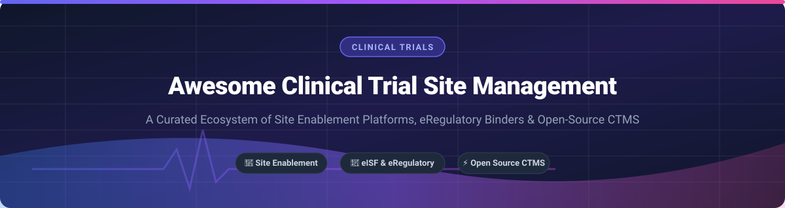

# Awesome Clinical Trial Site Management 🩺

  
  
  
  
  
  

## 📌 Top Clinical Trial Site Management Platforms Ecosystem

**A Curated List of SaaS Products, eRegulatory Binders, eSource Solutions & Open-Source GitHub Projects** 🧪

*Focused on Site Enablement, eRegulatory Binders (eISF), Clinical Trial Management Systems (CTMS), Electronic Data Capture (EDC), Financial Management & Multi-Sponsor Operations.* 📊

**Last updated: September 2026** 📅

---

### 🔍 Industry & Market Size Overview

> 💡 **Market Size & Structure**: The global **Clinical Trial Management System (CTMS) and Site Enablement market** is estimated at **$1.8B–$2.5B+** (2025–2026), expanding at a CAGR of ~11.5%. The broader eClinical software ecosystem spans over **$8B+** worldwide.
>
> ⚡ **Market Dynamics**: The market is **moderately fragmented**: life sciences giant Veeva Systems and enterprise provider Advarra occupy dominant positions in sponsor-site connectivity and institutional CTMS, while specialized site enablement platforms (Florence Healthcare, CRIO, RealTime-CTMS) command dedicated niches. A vibrant long-tail of open-source projects and mid-tier SaaS vendors continues to serve academic medical centers and independent research sites.

---

## 📑 Table of Contents
- [🏢 SaaS/Hosted Platforms](#-saashosted-platforms)
- [🔓 Open-Source GitHub Projects](#-open-source-github-projects)
- [🤝 How to Contribute](#-how-to-contribute)
- [🤝 Support & Sponsorship](#-support--sponsorship)
- [⚠️ Disclaimer](#%EF%B8%8F-disclaimer)
- [📈 Star History](#-star-history)

---

## 🏢 SaaS/Hosted Platforms

The table below presents commercial SaaS platforms for Clinical Trial Site Management, ordered by **Company Scale (Valuation / Billed Revenue)** in descending order.

| Platform | Company Scale (Valuation / Revenue) | Starting Pricing (Specific Tier) | Free Tier / Free Trial Limits | Key Site Features & Compliance |
| :--- | :--- | :--- | :--- | :--- |
| **[Veeva SiteVault](https://www.veeva.com/)** | **~$45.5 Billion Valuation** *(Public: VEEV, ~$3.2B Annual Revenue)* | Free Enterprise Tier for eligible research sites; Paid sponsor connectivity starting at quote tiers | **Free Enterprise Tier** for research sites with unlimited study storage and eISF compliance | Leading eISF and regulatory binder platform. Seamlessly connects site workflows with sponsor Veeva Vault eTMF networks. |
| **[Advarra OnCore & Clinical Conductor](https://www.advarra.com/)** | **~$5.0 Billion Valuation** *(Acquired by Blackstone/CPP, ~$100M-$500M Revenue)* | Custom institutional tiering (starting ~$15,000–$50,000/year base for site networks) | **No Free Tier**; Custom live sandbox demo available upon request for institutional sites | Enterprise CTMS for top academic medical centers, cancer centers, and site networks. Features CCE, CCS, CCText, and CCPay integrations. |
| **[TransPerfect Trial Interactive](https://www.transperfect.com/)** | **~$1.32 Billion Revenue** *(Private Parent Enterprise)* | Enterprise module licensing starting at ~$1,000/month per active trial site | **No Free Tier**; 14-day tailored trial workspace available for site network admins | eTMF, site activation, regulatory compliance, e-learning, and AI-powered document classification for research sites and CROs. |
| **[Florence Healthcare](https://florencehc.com/)** | **~$116 Million Raised / ~$58 Million Revenue** *(Series C-1)* | Site Enablement subscription starting at ~$500/month per active study site | **No Free Tier**; 30-day trial workspace available for trial site coordinators | Site Enablement Platform used by 65,000+ sites across 90+ countries. Provides eISF, eConsent, eSource, 21 CFR Part 11 & GCP compliance. |
| **[CRIO (Clinical Research IO)](https://www.crioclinical.com/)** | **~$20 Million Revenue** *(Private Equity Backed)* | Site eSource & CTMS bundle starting at ~$200/month per site | **No Free Tier**; 14-day guided sandbox demo provided for research sites | Paperless site platform offering turnkey eSource, eRegulatory/eISF, eConsent, coordinator scheduling, and patient stipend payments. |
| **[RealTime-CTMS](https://realtime-ctms.com/)** | **~$15 Million Revenue** *(Private)* | Site package starting at ~$350/month base fee for site management | **No Free Tier**; 30-day interactive demo environment available for SMOs and sites | Cloud CTMS built specifically for research sites & SMOs. Manages patient recruitment, coordinator scheduling, visit tracking, and site finances. |
| **[SimpleTrials](https://simpletrials.com/)** | **~$5 Million Revenue** *(On-Demand SaaS)* | **$99/month** (Starter Plan for small teams and 3 active studies) | **No Free Tier**; 30-day free trial on Starter Plan with full site feature access | Transparent subscription CTMS for small to mid-sized research sites and CROs. Includes study tracking, budgeting, and document management. |
| **[ClinPlus](https://clinplus.com/)** | **~$3 Million Revenue** *(Private)* | On-demand trial management starting at ~$250/month per study | **No Free Tier**; 14-day trial available upon site verification | Modular CTMS and electronic data capture platform built for independent research sites and specialty clinics. |
| **[Complion](https://complion.com/)** | **Acquired by RealTime Software** | Integrated eReg tier starting at ~$300/month per site | **No Free Tier**; Customized site demo and trial environment available | Specialized eRegulatory binder and compliance platform providing eSignatures, audit trails, and document workflow automation. |

---

## 🔓 Open-Source GitHub Projects

The list below highlights top self-hostable open-source platforms and developer toolkits for clinical trial management, sorted by **GitHub Star Count** in descending order.

- **[Google Cloud Healthcare Data Engine](https://github.com/GoogleCloudPlatform/healthcare)**  🌟
  Open-source reference architectures, FHIR tools, and data harmonization pipelines for clinical research data ingestion, interoperability, and site data integration.

- **[OpenClinica](https://github.com/OpenClinica/OpenClinica)**  🌟
  **The world's first commercial open-source clinical trial software** for Electronic Data Capture (EDC) and Clinical Data Management (CDM). Supports study building, eCRF design, data validation, and audit trails.

- **[OHDSI Atlas](https://github.com/OHDSI/Atlas)**  🌟
  Open-source unified web client for conducting patient cohort discovery, clinical feasibility analysis, and observational trial design on OMOP Common Data Model repositories.

- **[FreeMED EMR / PM](https://github.com/freemed/freemed)**  🌟
  Open-source Electronic Medical Record and Practice Management System. Adaptable for clinical research site administration, patient registration, and scheduling workflows.

- **[LibreClinica](https://github.com/reliatec-gmbh/LibreClinica)**  🌟
  **Community-driven successor to OpenClinica** (LGPL-3.0 Java-based EDC/CDM). Offers eCRF design, data validation, audit logs, and CDISC ODM-XML standard data exports.

- **[Phoenix CTMS](https://github.com/phoenixctms/ctsms)**  🌟
  **The most comprehensive open-source CTMS/PRS/CDMS** (Clinical Trial Management System / Patient Recruitment System / Clinical Data Management System). Java-based, providing complete operational and patient tracking capabilities.

- **[CogStack](https://github.com/cogstack/CogStack)**  🌟
  Information retrieval and NLP platform for healthcare research sites to mine unstructured electronic health records (EHR) for trial recruitment and eligibility screening.

- **[OpenEDC](https://github.com/hannesill/m4)**  🌟
  CDISC ODM-compliant lightweight Electronic Data Capture system designed for academic and translational clinical research sites.

- **[RPACT Adaptive Trial Framework](https://github.com/rpact-com/rpact)**  🌟
  Open-source R package for group sequential design and adaptive trial calculation used by biostatisticians in clinical study design.

- **[clinicedc Framework](https://github.com/clinicedc/edc)**  🌟
  **Modular Django Python framework** for building custom EDC and site management software. Includes packages for appointment scheduling (`edc-appointment`), visit tracking (`edc-visit-schedule`), and patient intake.

- **[VOXCE CTMS](https://github.com/trialmanager/voxce)**  🌟
  Open-source clinical trial management framework providing operational data collection, study monitoring, and multi-center site coordination.

- **[ClinTrialFinder AI](https://github.com/chncwang/ClinTrialFinder)**  🌟
  AI-powered clinical trial patient matching system using LLMs to evaluate patient medical records against trial eligibility criteria.

---

## 🤝 How to Contribute

1. 🍴 **Fork** the repository.
2. 📝 **Add or edit** entries in `README.md` (maintain consistent markdown formatting).
3. ℹ️ **Provide details**: Include software name, official URL, concise description, and pricing/open-source model.
4. 🚀 **Submit a Pull Request** with a clear explanation of your additions.

---

## 🤝 Support & Sponsorship

If you find this curated list valuable for your research site, academic center, or healthtech project, please consider supporting the project:

- ⭐ **Star this repository** on GitHub to help others discover it!
- 🔀 **Fork and share** with research coordinators, trial managers, and IT teams.
- ☕ **Buy me a coffee / Sponsor**: Support ongoing maintenance on the [GitHub Sponsors Dashboard](https://github.com/sponsors/ishandutta2007).

---

## ⚠️ Disclaimer

- This is a **community-curated list** provided for informational purposes — it does not constitute formal software endorsement.
- Clinical trial site management platforms handle sensitive personal health information (PHI) and regulatory documentation. Ensure all evaluated systems comply with **21 CFR Part 11, ICH-GCP E6(R2), HIPAA, GDPR, and local IRB guidelines**.

---

## 📈 Star History

